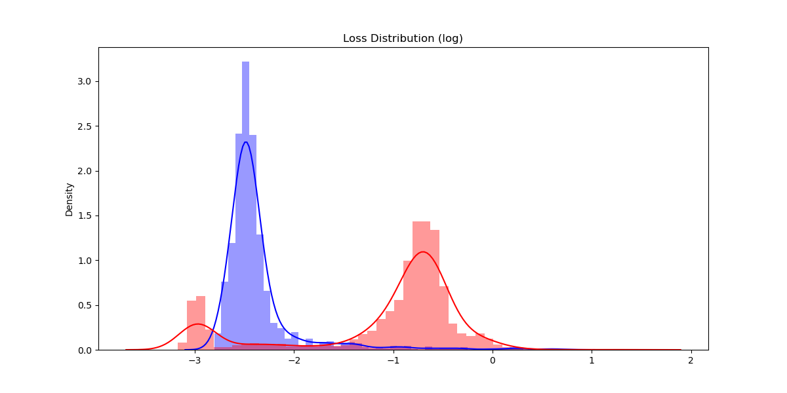

# ECG abnormal classification

## Requiremnts: 
* Pytorch
* Tensorboard
* Numpy
* argsparse
* sklearn
* seaborn
* matplotlib

## Files
* ECG_reconstruction.py: Main file
* models.py: Models define
* train_pred.py: Train and prediction function
* utils.py

## Results

